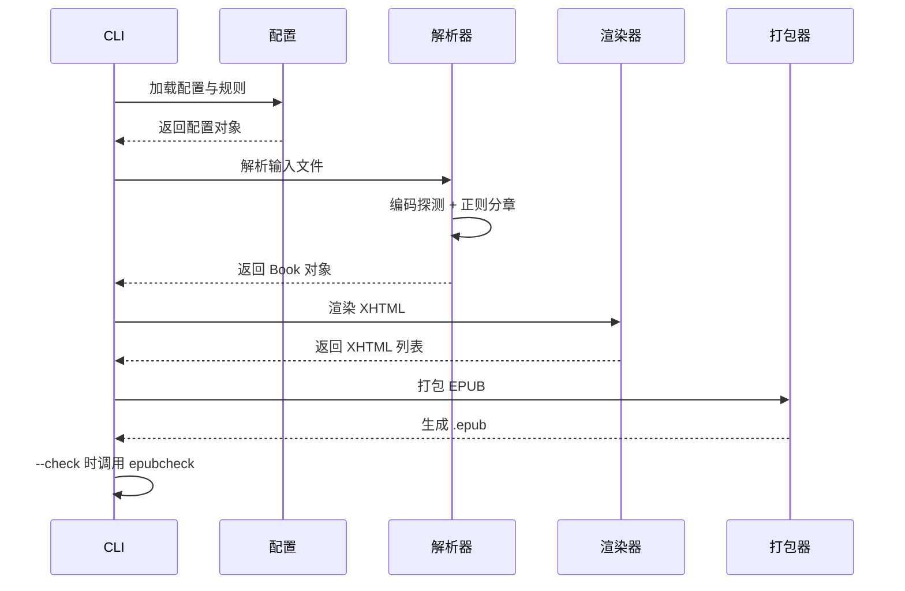

---
nav:
  title: 架构总图
  order: 10
---

# 架构总图

薄总图：只导航，不压缩细则。操作级规则写在 `docs/topics/<topic>/` 或 `.agents/notes/`。

## 1. 系统是什么

EpubSmith 是一个 Rust 编写的 TXT → EPUB 命令行工具：输入纯文本（文件/目录/STDIN，可多文件合并），经**解析 → 渲染 → 打包**三条主链路生成标准 EPUB。核心承诺是输出可预测、稳定、可复用（快照）；其他格式（PDF/Kindle 等）交给下游专业工具。命令细节见 [cli](./topics/cli/)，解析见 [rules](./topics/rules/)，样式封面见 [styling](./topics/styling/)，打包发布见 [delivery](./topics/delivery/)。

## 2. 组成

```text
src/
├── cli.rs             # 子命令与参数解析（clap）
├── config.rs          # 配置与规则文件加载
├── models.rs          # 核心数据模型 + 内置默认规则
├── parser/            # 编码探测 + 章节解析
│   ├── encoding.rs
│   └── chapter.rs
├── cover.rs           # 封面生成（SVG 模板 → resvg 栅格化 PNG）
├── doctor.rs          # 章节质量诊断与建议
├── renderer/          # Book → XHTML（章节/导航/封面页）
├── packager.rs        # XHTML + CSS → EPUB（ZIP）
├── export.rs          # template export 导出模板/样式/封面
├── output.rs          # 输出格式化与显示
├── utils/             # coherence / html / number 工具
├── templates/         # Tera 模板（chapter/nav/toc.ncx/cover/opf）
└── resources/css/     # 默认样式表 default.css
```

边界约定：parser 只管解析、renderer 只管渲染、packager 只管打包，模块间通过 `models.rs` 的 Book 结构传递数据，不互相调用业务逻辑。

## 3. 主链路

一次 `convert` 的事件序列：



`preview`（outline/dry-run）与 `snapshot save` 复用解析链路，在渲染前结束；`snapshot load` 与 `template export` 从各自入口进入渲染/导出，不经解析。

## 4. 新行为挂哪

| 目标 | 机制 / 目录 | 细节见 |
|------|-------------|--------|
| 新增/修改 CLI 参数或子命令 | `src/cli.rs` + 对应命令 handler | [topics/cli/](./topics/cli/) |
| 调整章节识别、编码、默认规则 | `src/parser/` + `src/models.rs` | [topics/rules/](./topics/rules/) |
| 调整样式、封面、预览页 | `src/renderer/` + `src/templates/` + `src/cover.rs` | [topics/styling/](./topics/styling/) |
| 调整打包、校验、发布流程 | `src/packager.rs` + `scripts/` | [topics/delivery/](./topics/delivery/) |
