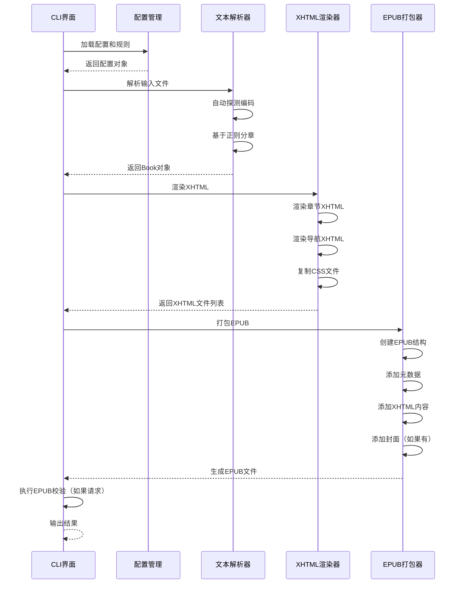
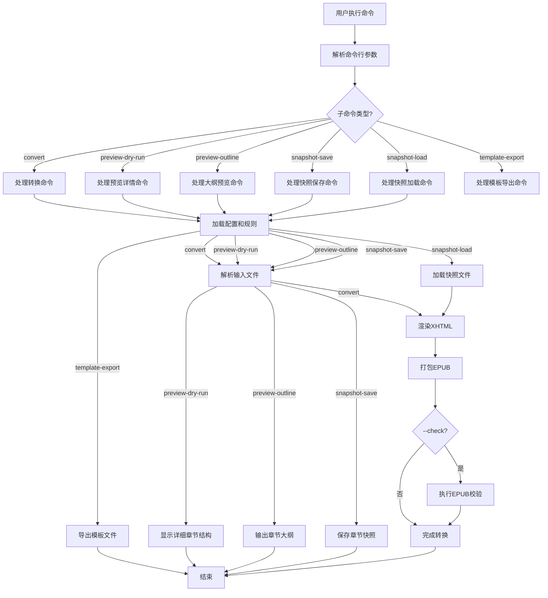
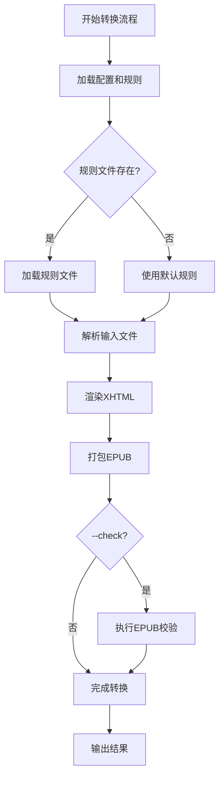
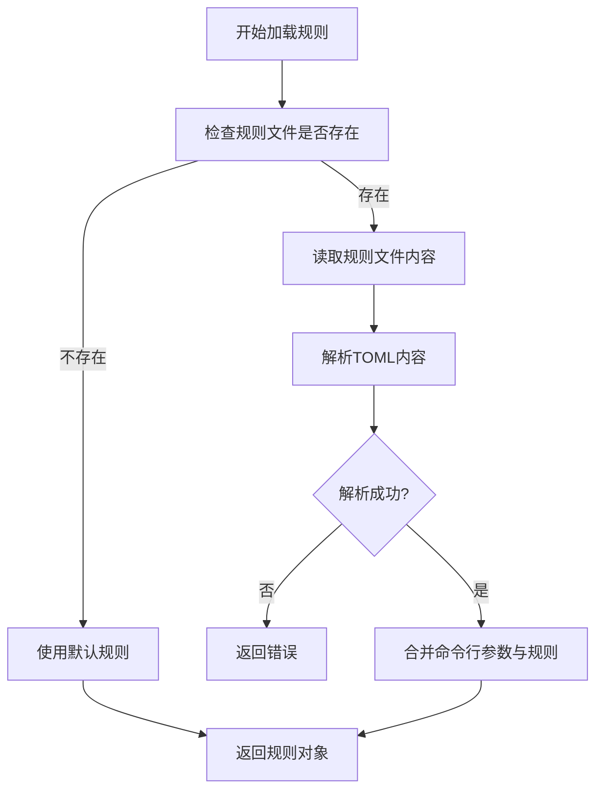
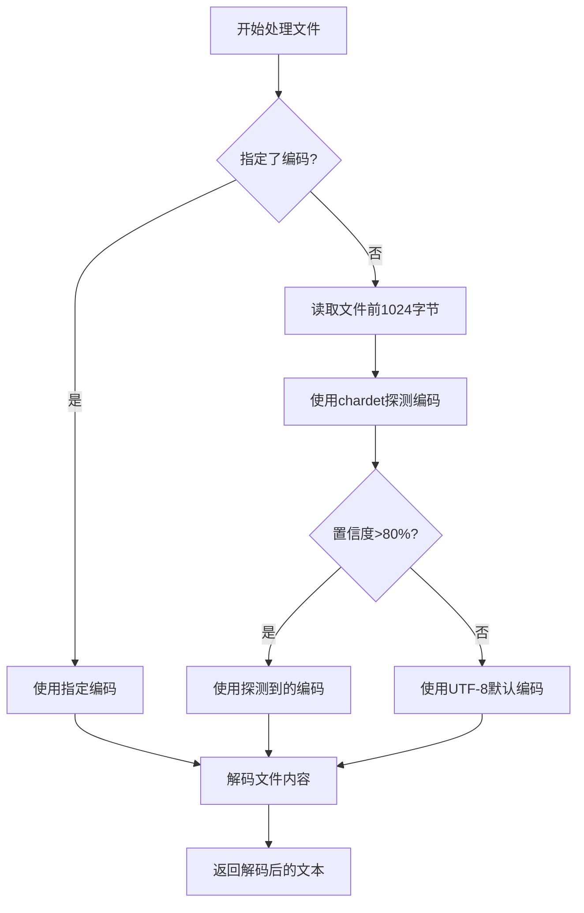
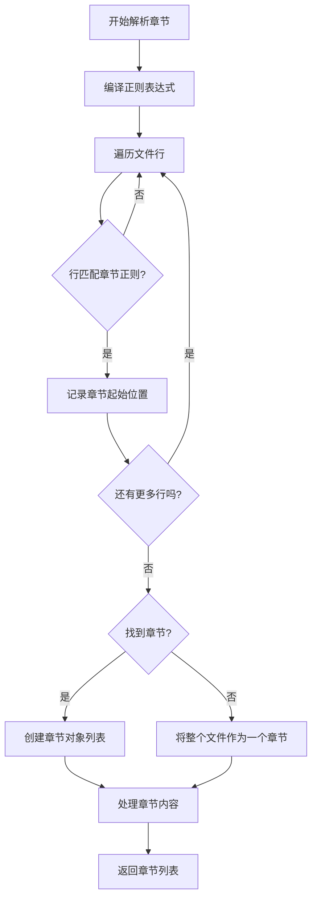

# 数据流与时序

## 事件数据流程

```mermaid
sequenceDiagram
    participant CLI as CLI界面
    participant Config as 配置管理
    participant Parser as 文本解析器
    participant Renderer as XHTML渲染器
    participant Packager as EPUB打包器
    
    CLI->>Config: 加载配置和规则
    Config-->>CLI: 返回配置对象
    CLI->>Parser: 解析输入文件
    Parser->>Parser: 自动探测编码
    Parser->>Parser: 基于正则分章
    Parser-->>CLI: 返回Book对象
    CLI->>Renderer: 渲染XHTML
    Renderer->>Renderer: 渲染章节XHTML
    Renderer->>Renderer: 渲染导航XHTML
    Renderer->>Renderer: 复制CSS文件
    Renderer-->>CLI: 返回XHTML文件列表
    CLI->>Packager: 打包EPUB
    Packager->>Packager: 创建EPUB结构
    Packager->>Packager: 添加元数据
    Packager->>Packager: 添加XHTML内容
    Packager->>Packager: 添加封面（如果有）
    Packager-->>CLI: 生成EPUB文件
    CLI->>CLI: 执行EPUB校验（如果请求）
    CLI-->>CLI: 输出结果
```

## 交互流程

### 5.1 子命令处理流程

```mermaid
flowchart TD
    A[用户执行命令] --> B[解析命令行参数]
    B --> C{子命令类型?}
    
    C -->|convert| D[处理转换命令]
    C -->|preview-dry-run| E[处理预览详情命令]
    C -->|preview-outline| F[处理大纲预览命令]
    C -->|snapshot-save| G[处理快照保存命令]
    C -->|snapshot-load| H[处理快照加载命令]
    C -->|template-export| I[处理模板导出命令]
    
    D --> J[加载配置和规则]
    E --> J
    F --> J
    G --> J
    H --> J
    
    J -->|convert| K[解析输入文件]
    J -->|preview-dry-run| K
    J -->|preview-outline| K
    J -->|snapshot-save| K
    J -->|snapshot-load| L[加载快照文件]
    J -->|template-export| M[导出模板文件]
    
    K -->|convert| N[渲染XHTML]
    K -->|preview-dry-run| O[显示详细章节结构]
    K -->|preview-outline| P[输出章节大纲]
    K -->|snapshot-save| Q[保存章节快照]
    
    N --> R[打包EPUB]
    R --> S{--check?}
    S -->|是| T[执行EPUB校验]
    S -->|否| U[完成转换]
    T --> U
    
    L --> N
    M --> V[结束]
    O --> V
    P --> V
    Q --> V
    U --> V
```

### 5.2 转换子命令详细流程

```mermaid
flowchart TD
    A[开始转换流程] --> B[加载配置和规则]
    B --> C{规则文件存在?}
    C -->|是| D[加载规则文件]
    C -->|否| E[使用默认规则]
    D --> F[解析输入文件]
    E --> F
    F --> G[渲染XHTML]
    G --> H[打包EPUB]
    H --> I{--check?}
    I -->|是| J[执行EPUB校验]
    I -->|否| K[完成转换]
    J --> K
    K --> L[输出结果]
```

### 5.3 规则文件加载流程

```mermaid
flowchart TD
    A[开始加载规则] --> B[检查规则文件是否存在]
    B -->|不存在| C[使用默认规则]
    B -->|存在| D[读取规则文件内容]
    D --> E[解析TOML内容]
    E --> F{解析成功?}
    F -->|否| G[返回错误]
    F -->|是| H[合并命令行参数与规则]
    C --> I[返回规则对象]
    H --> I
```

### 5.4 编码处理流程

```mermaid
flowchart TD
    A[开始处理文件] --> B{指定了编码?}
    B -->|是| C[使用指定编码]
    B -->|否| D[读取文件前1024字节]
    D --> E[使用chardet探测编码]
    E --> F{置信度>80%?}
    F -->|是| G[使用探测到的编码]
    F -->|否| H[使用UTF-8默认编码]
    C --> I[解码文件内容]
    G --> I
    H --> I
    I --> J[返回解码后的文本]
```

### 5.5 章节解析流程

```mermaid
flowchart TD
    A[开始解析章节] --> B[编译正则表达式]
    B --> C[遍历文件行]
    C --> D{行匹配章节正则?}
    D -->|是| E[记录章节起始位置]
    D -->|否| C
    E --> F{还有更多行吗?}
    F -->|是| C
    F -->|否| G{找到章节?}
    G -->|是| H[创建章节对象列表]
    G -->|否| I[将整个文件作为一个章节]
    H --> J[处理章节内容]
    I --> J
    J --> K[返回章节列表]
```
