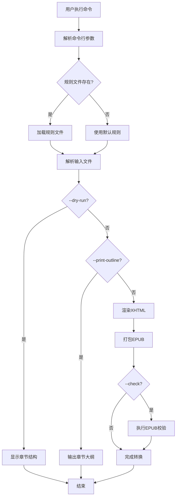
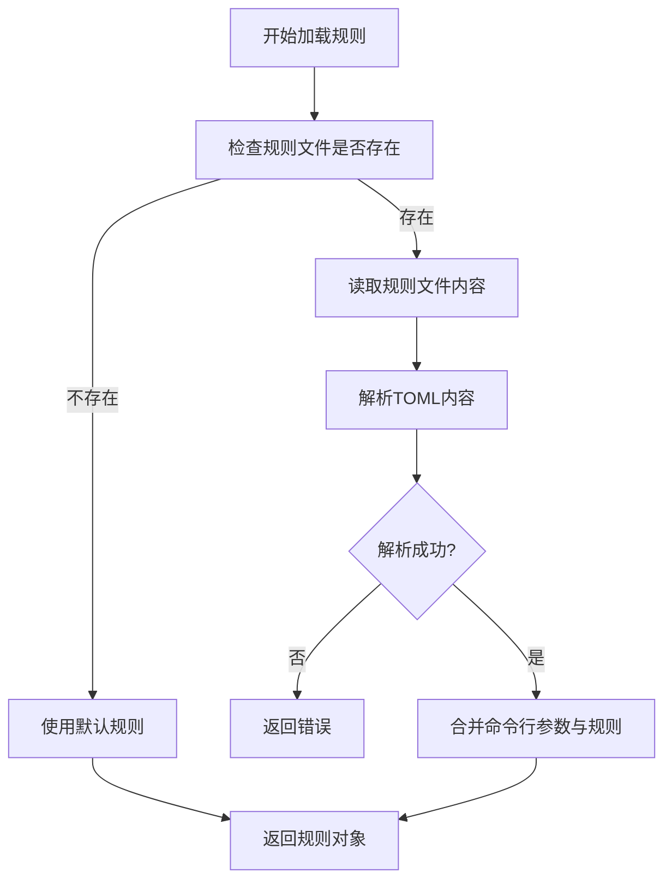
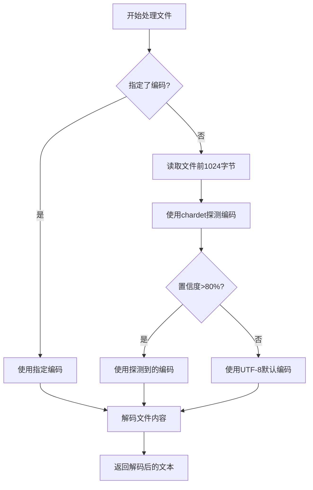
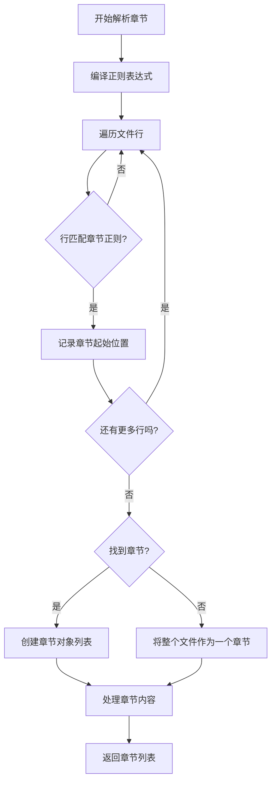

# BookSmith 技术设计文档

## 1. 目录结构

```
booksmith/
├── src/                         # 源代码目录
│   ├── main.rs                  # 主入口文件
│   ├── lib.rs                   # 库入口文件
│   ├── cli.rs                   # CLI参数定义与解析
│   ├── config.rs                # 配置管理
│   ├── models.rs                # 核心数据模型
│   ├── parser/                  # 文本解析模块
│   │   ├── mod.rs               # 解析模块入口
│   │   ├── encoding.rs          # 编码处理
│   │   └── chapter.rs           # 章节解析
│   ├── renderer/                # 渲染模块
│   │   └── mod.rs               # 渲染模块入口
│   ├── packager.rs              # EPUB打包模块
│   ├── templates/               # 模板文件
│   │   ├── chapter.xhtml.tera   # 章节XHTML模板
│   │   └── nav.xhtml.tera       # 导航XHTML模板
│   └── resources/               # 资源文件
│       └── css/                 # CSS样式
│           └── default.css      # 默认样式表
├── examples/                    # 示例文件
│   ├── sample.txt               # 示例文本
│   └── rules.toml               # 示例规则
├── tests/                       # 测试目录
│   ├── cli.rs                   # CLI测试
│   ├── parser.rs                # 解析器测试
│   ├── renderer.rs              # 渲染器测试
│   └── packager.rs              # 打包器测试
├── docs/                        # 文档目录
│   ├── technical-design.md      # 技术设计文档
│   └── user-guide.md            # 用户指南
├── Cargo.toml                   # 项目配置
├── Cargo.lock                   # 依赖锁定
├── README.md                    # 项目说明
└── .gitignore                   # Git忽略文件
```

## 2. 文件作用与边界

### 2.1 主入口文件

| 文件 | 作用 | 边界 |
|------|------|------|
| `main.rs` | 程序主入口，处理命令行参数，协调各模块工作 | 仅负责流程控制，不包含业务逻辑 |
| `lib.rs` | 库入口，导出公共API | 定义模块结构，不包含实现细节 |

### 2.2 核心模块

| 文件 | 作用 | 边界 |
|------|------|------|
| `cli.rs` | 定义和解析命令行参数 | 仅处理CLI相关逻辑，不涉及业务处理 |
| `config.rs` | 管理应用配置，加载规则文件 | 仅处理配置相关逻辑 |
| `models.rs` | 定义核心数据结构 | 仅包含数据模型定义，不包含业务逻辑 |

### 2.3 解析模块

| 文件 | 作用 | 边界 |
|------|------|------|
| `parser/mod.rs` | 解析模块入口，协调编码处理和章节解析 | 仅负责模块间协调 |
| `parser/encoding.rs` | 自动探测和转换文件编码 | 仅处理编码相关逻辑 |
| `parser/chapter.rs` | 基于正则表达式解析章节 | 仅处理章节解析逻辑 |

### 2.4 渲染模块

| 文件 | 作用 | 边界 |
|------|------|------|
| `renderer/mod.rs` | 将Book数据渲染为XHTML | 仅处理XHTML渲染，不涉及EPUB打包 |

### 2.5 打包模块

| 文件 | 作用 | 边界 |
|------|------|------|
| `packager.rs` | 将XHTML文件打包为EPUB | 仅处理EPUB打包，不涉及XHTML渲染 |

### 2.6 模板与资源

| 文件 | 作用 | 边界 |
|------|------|------|
| `templates/chapter.xhtml.tera` | 章节XHTML模板 | 仅定义模板结构，不包含业务逻辑 |
| `templates/nav.xhtml.tera` | 导航XHTML模板 | 仅定义模板结构，不包含业务逻辑 |
| `resources/css/default.css` | 默认CSS样式 | 仅定义样式，不包含业务逻辑 |

## 3. 事件数据流程

```
mermaid
sequenceDiagram
    participant CLI as CLI界面
    participant Config as 配置管理
    participant Parser as 文本解析器
    participant Renderer as XHTML渲染器
    participant Packager as EPUB打包器
    
    CLI->>Config: 加载配置和规则
    Config-->>CLI: 返回配置对象
    CLI->>Parser: 解析输入文件
    Parser->>Parser: 自动探测编码
    Parser->>Parser: 基于正则分章
    Parser-->>CLI: 返回Book对象
    CLI->>Renderer: 渲染XHTML
    Renderer->>Renderer: 渲染章节XHTML
    Renderer->>Renderer: 渲染导航XHTML
    Renderer->>Renderer: 复制CSS文件
    Renderer-->>CLI: 返回XHTML文件列表
    CLI->>Packager: 打包EPUB
    Packager->>Packager: 创建EPUB结构
    Packager->>Packager: 添加元数据
    Packager->>Packager: 添加XHTML内容
    Packager->>Packager: 添加封面（如果有）
    Packager-->>CLI: 生成EPUB文件
    CLI->>CLI: 执行EPUB校验（如果请求）
    CLI-->>CLI: 输出结果
```

## 4. 命令行参数设计

| 参数 | 简写 | 类型 | 描述 | 默认值 | 必需 |
|------|------|------|------|--------|------|
| `<INPUT>` | - | 文件/目录路径 | 输入TXT文件或目录 | - | 是 |
| `--rules` | `-r` | 文件路径 | 规则文件路径 | - | 否 |
| `--output` | `-o` | 文件路径 | 输出EPUB文件路径 | `book.epub` | 否 |
| `--encoding` | `-e` | 字符串 | 强制输入文件编码 | 自动探测 | 否 |
| `--dry-run` | - | 标志 | 仅显示章节结构，不生成EPUB | `false` | 否 |
| `--print-outline` | - | 标志 | 输出章节大纲 | `false` | 否 |
| `--explain` | - | 标志 | 解释解析过程 | `false` | 否 |
| `--title` | - | 字符串 | 指定书名 | 从文件名或规则获取 | 否 |
| `--author` | - | 字符串 | 指定作者 | 从规则获取或"Unknown" | 否 |
| `--cover` | - | 文件路径 | 指定封面图片路径 | 从规则获取或无 | 否 |
| `--language` | - | 字符串 | 指定语言 | `zh-CN` | 否 |
| `--check` | - | 标志 | 调用epubcheck校验 | `false` | 否 |
| `--verbose` | `-v` | 标志 | 详细日志输出 | `false` | 否 |
| `--help` | `-h` | 标志 | 显示帮助信息 | - | 否 |
| `--version` | `-V` | 标志 | 显示版本信息 | - | 否 |

## 5. 交互流程

### 5.1 基本转换流程



### 5.2 规则文件加载流程



### 5.3 编码处理流程



### 5.4 章节解析流程



## 6. 设计合理性与人体工学检查

### 6.1 优势

1. **模块化设计**：清晰的模块划分，便于维护和扩展
2. **合理的依赖关系**：模块间依赖关系简单，降低耦合度
3. **用户友好的CLI**：
   - 直观的命令结构
   - 清晰的参数命名
   - 合理的默认值
   - 详细的帮助信息
4. **可视化反馈**：
   - --dry-run模式提供即时反馈
   - --print-outline模式提供清晰的章节结构
   - 彩色输出增强可读性
5. **可解释性**：--explain模式帮助用户理解解析过程
6. **规则即资产**：规则文件可复用、可版本控制
7. **输出稳定性**：同一规则+同一版本=同一结果

### 6.2 改进建议

1. **并行处理**：对于大文件，可以考虑并行处理章节
2. **进度显示**：添加进度条，特别是处理大文件时
3. **交互式规则生成**：添加向导式规则生成功能
4. **规则验证**：在加载规则时验证正则表达式的有效性
5. **更多输出格式**：考虑支持其他电子书格式（如MOBI）

## 7. 边界条件处理

1. **空文件**：优雅处理空输入文件
2. **超大文件**：使用流式处理，避免内存溢出
3. **无效编码**：提供清晰的错误信息，建议使用正确编码
4. **无效规则**：提供清晰的错误信息，指出规则文件中的问题
5. **重复章节标题**：使用序号区分，避免文件名冲突
6. **缺失元数据**：提供合理的默认值
7. **不支持的封面格式**：转换为支持的格式或提供错误信息
8. **输出文件已存在**：询问用户是否覆盖，或使用--force参数
9. **权限问题**：提供清晰的错误信息，建议解决方案
10. **EPUB校验失败**：提供详细的错误信息，帮助用户修复问题

## 8. 性能考虑

1. **编码处理**：仅读取文件前1024字节进行编码探测，减少I/O操作
2. **正则表达式**：编译正则表达式一次，重复使用
3. **内存使用**：使用合适的数据结构，避免不必要的内存分配
4. **临时文件**：使用tempfile库管理临时文件，自动清理
5. **并行处理**：考虑对章节渲染和打包进行并行处理

## 9. 安全性考虑

1. **文件权限**：确保生成的EPUB文件具有合理的权限
2. **路径遍历**：验证输入和输出路径，避免路径遍历攻击
3. **恶意输入**：处理恶意构造的TXT文件，避免崩溃
4. **资源限制**：设置合理的资源限制，防止DoS攻击
5. **依赖安全**：定期更新依赖，修复安全漏洞

## 10. 测试策略

1. **单元测试**：覆盖核心功能，如编码处理、章节解析、XHTML渲染
2. **集成测试**：验证完整的转换流程
3. **端到端测试**：测试命令行工具的完整功能
4. **边界测试**：测试边界条件，如空文件、超大文件、无效编码
5. **性能测试**：测试处理大文件的性能
6. **兼容性测试**：测试生成的EPUB在不同阅读器上的兼容性

## 11. 部署与分发

1. **跨平台支持**：支持Windows、macOS、Linux
2. **单一可执行文件**：编译为单一可执行文件，便于分发
3. **包管理器支持**：支持通过cargo install安装
4. **预编译二进制文件**：提供预编译的二进制文件，便于快速安装
5. **Docker支持**：提供Docker镜像，便于在容器环境中使用

## 12. 版本管理

1. **语义化版本**：使用语义化版本管理，确保向后兼容
2. **变更日志**：维护详细的变更日志，记录每次更新的内容
3. **稳定分支**：维护稳定分支，提供长期支持
4. **API稳定性**：确保公共API的稳定性，避免破坏性变更

## 13. 未来扩展

1. **更多输入格式**：支持更多文本格式，如Markdown、HTML
2. **更多输出格式**：支持MOBI、AZW3等格式
3. **GUI版本**：考虑开发GUI版本，便于非技术用户使用
4. **云服务集成**：支持从云存储读取和写入文件
5. **插件系统**：支持插件扩展功能
6. **规则市场**：提供共享规则的平台
7. **自动规则生成**：基于机器学习自动生成规则

## 14. 结论

BookSmith的技术设计遵循了模块化、可维护性、用户友好性和性能优化的原则。通过清晰的模块划分、合理的数据流设计和用户友好的CLI界面，BookSmith将为用户提供一个可靠、可解释、可复用的TXT到EPUB转换工具。设计中考虑了各种边界条件和性能因素，确保工具在各种情况下都能正常工作。未来扩展的设计也为工具的长期发展留下了空间。